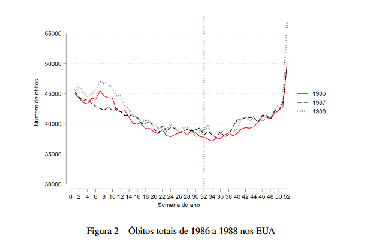
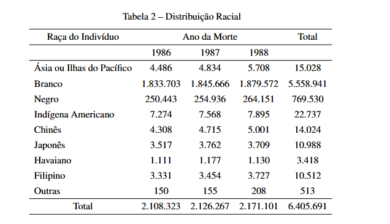
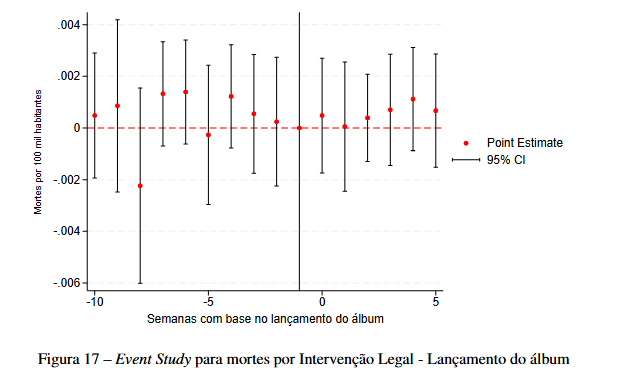
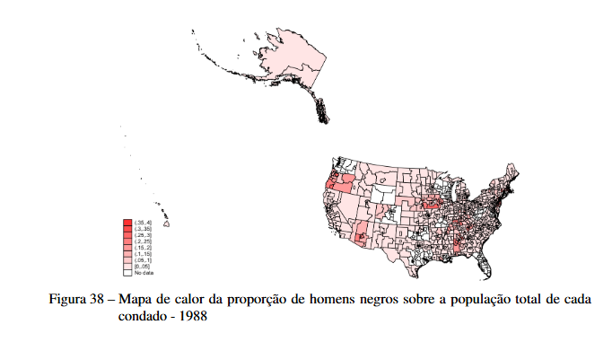
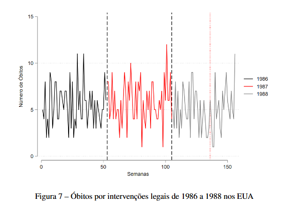
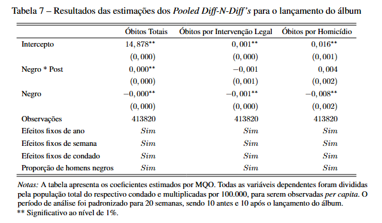

# Código em R e Stata do meu TCC!

## Título -  O Rap e a Cultura: O efeito do lançamento de "Straight Outta Compton" sobre a violência contra a comunidade negra nos EUA

A pesquisa começou como uma Iniciação Científica, que depois se estendeu ao meu TCC. A ideia foi, a partir dos dados de mortalidade do _National Center of Health Statistics (NCHS)_ dos EUA, o _Multiple Cause-of-Death Mortality Data_, dos anos de 1986 a 1988, junto com dados da população por condado do país no mesmo ano, utilizar os métodos quantitativos de **_Pooled Differences in Differences_** e **_Event Study_** para analisar se o lançamento do álbum, feito em agosto de 1988, teve impacto sobre as mortes de indivíduos negros nos Estados Unidos quando comparados a indivíduos de outras raças.

### Alguns gráficos e tabelas feitos para o trabalho:

  
  

  
  

  
  

